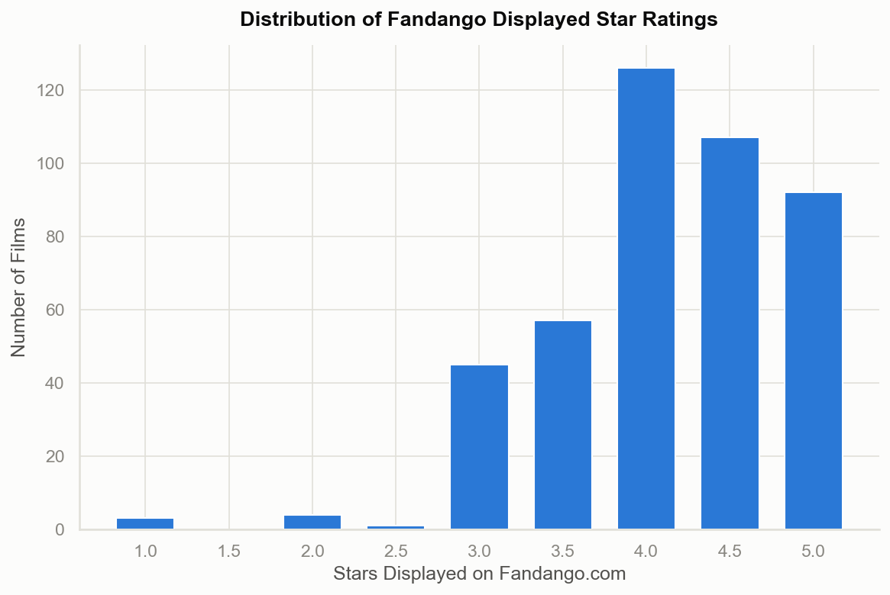
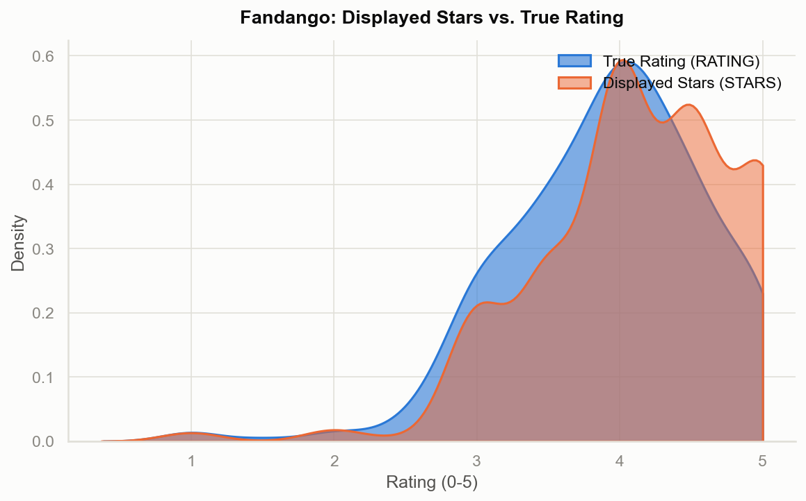
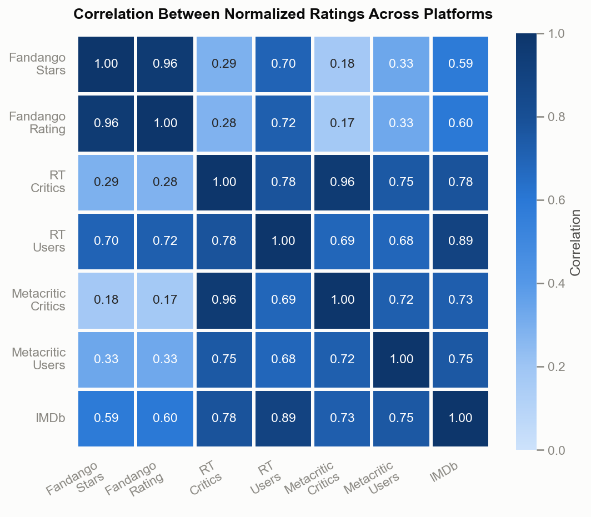
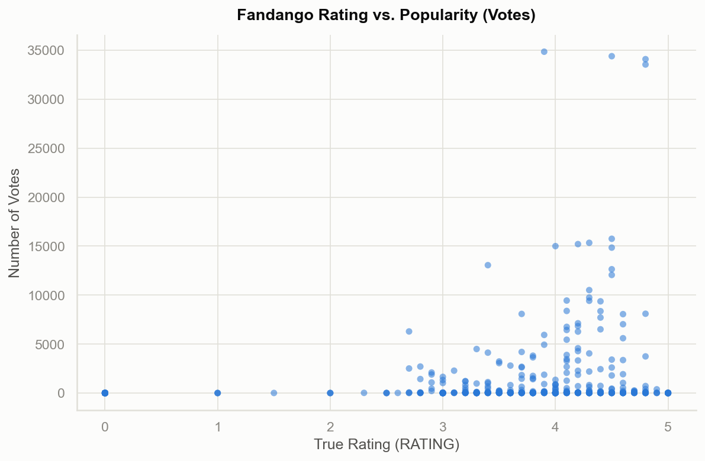
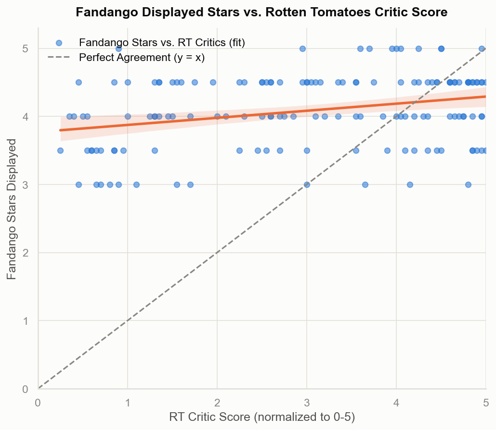
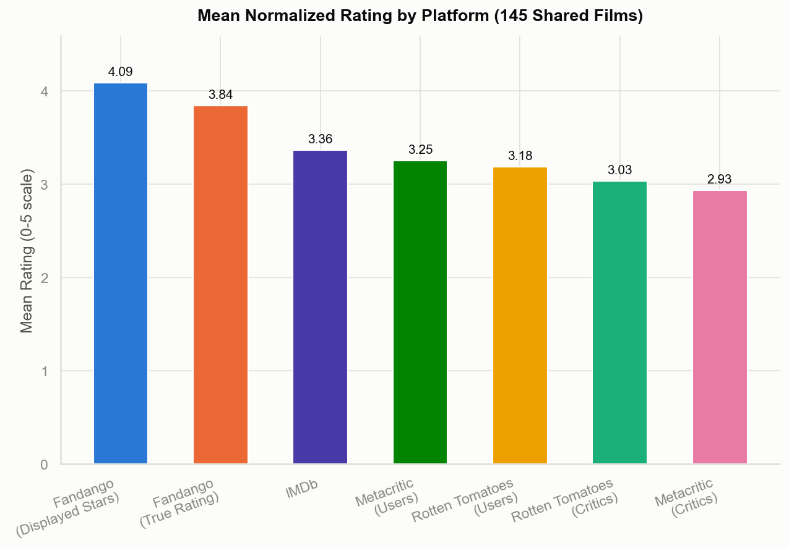

<div align="center">

# 🎬 Fandango Ratings Analysis

### 📊 Exploratory Data Analysis of Movie Ratings using Python


[](https://colab.research.google.com/github/Beingnav/fandango-ratings-analysis/blob/main/Notebook/Fandango_Ratings_Analysis.ipynb)

---

### ⭐ Exploratory Data Analysis of Fandango Movie Ratings

**Analyzing rating patterns, identifying potential rating bias, and comparing Fandango ratings with other major movie review platforms using Python and Data Visualization.**

### 🚀 [Live Demo — Run the Notebook in Google Colab](https://colab.research.google.com/github/Beingnav/fandango-ratings-analysis/blob/main/Notebook/Fandango_Ratings_Analysis.ipynb)

</div>

---

# 📌 Project Overview

This project performs an **Exploratory Data Analysis (EDA)** on movie ratings collected from **Fandango** and other well-known review platforms including **IMDb**, **Rotten Tomatoes**, and **Metacritic**.

The analysis investigates whether Fandango ratings were systematically higher than ratings from competing platforms by applying statistical analysis and visualization techniques.

The project demonstrates practical data analytics skills including:

- Data Cleaning
- Exploratory Data Analysis
- Statistical Analysis
- Correlation Analysis
- Data Visualization
- Business Storytelling

using Python libraries such as **Pandas**, **NumPy**, **Matplotlib**, and **Seaborn**.

---

# 🎯 Business Problem

Moviegoers rely on online review platforms to decide which films to watch. If a platform consistently displays higher ratings than others, users may receive a misleading impression of a movie's quality.

This project explores whether Fandango ratings exhibit such a pattern by comparing them with ratings from multiple review platforms and analyzing the distributions statistically.

---

# 🎯 Project Objectives

- Analyze movie rating distributions.
- Compare Fandango ratings with other review platforms.
- Detect potential rating bias.
- Perform exploratory data analysis using Python.
- Create informative visualizations.
- Identify meaningful trends and correlations.
- Present insights through clear data storytelling.

---

# 🛠 Technology Stack

| Category | Tools |
|-----------|-------|
| Programming Language | Python |
| Data Manipulation | Pandas, NumPy |
| Visualization | Matplotlib, Seaborn |
| Development Environment | Jupyter Notebook |
| Version Control | Git, GitHub |

---

# 📂 Repository Structure

```text
Fandango-Ratings-Analysis/
│
├── Data/
│   ├── all_sites_scores.csv
│   └── fandango_scrape.csv
│
├── Notebook/
│   └── Fandango_Ratings_Analysis.ipynb
│
├── Dashboard_Screenshots/
│   ├── 01_Ratings_Distribution.png
│   ├── 02_KDE_Comparison.png
│   ├── 03_Correlation.png
│   ├── 04_Scatter_Plot.png
│   ├── 05_Regression.png
│   └── 06_Final_Insights.png
│
├── Documentation/
│   ├── Project_Report.pdf
│   ├── Findings.md
│   ├── Data_Dictionary.md
│   └── Methodology.md
│
├── requirements.txt
├── LICENSE
├── .gitignore
├── CONTRIBUTING.md
└── README.md
```

---

# 📊 Dataset

This project uses two datasets:

## 1. all_sites_scores.csv

Contains movie ratings collected from multiple movie review platforms.

### Includes

- Movie Title
- Rotten Tomatoes Score
- Rotten Tomatoes Critics Score
- Metacritic Score
- IMDb Rating
- Fandango Rating
- Vote Count

---

## 2. fandango_scrape.csv

Contains ratings scraped directly from the Fandango website for analysis and comparison.

---

# 📈 Dashboard & Visualizations

All charts are generated directly from the analysis notebook and saved to
[`Dashboard_Screenshots/`](Dashboard_Screenshots).

<div align="center">

| Ratings Distribution | Displayed Stars vs. True Rating |
|:---:|:---:|
|  |  |

| Cross-Platform Correlation | Rating vs. Popularity |
|:---:|:---:|
|  |  |

| Fandango vs. Rotten Tomatoes Critics | Mean Rating by Platform |
|:---:|:---:|
|  |  |

</div>

---

# 🔍 Key Findings

- Fandango's **displayed** stars average **0.21 stars higher** than its own **true**
  rating, across 435 reviewed films — a one-directional rounding-up bias.
- **87.8%** of reviewed films display 3.5 stars or higher; almost none display below 3.0.
- Averaged across the 145 films shared by every platform, Fandango's displayed stars
  (**4.09 / 5**) rank highest of any platform — **1.15 points above Metacritic critics**
  (2.93 / 5), the most independent source in the dataset.
- Fandango's displayed stars correlate with Rotten Tomatoes critic scores at just
  **0.29** — the weakest pairing in the dataset. Two independent critic sources (RT
  critics vs. Metacritic critics) correlate at **0.96**.
- Films with very low critic scores (e.g. *Taken 3*, RT critics 0.45 / 5) still display
  high Fandango stars (4.5 / 5).

📄 Full write-up: [`Documentation/Findings.md`](Documentation/Findings.md)
🧪 Methodology: [`Documentation/Methodology.md`](Documentation/Methodology.md)
📘 Full report: [`Documentation/Project_Report.pdf`](Documentation/Project_Report.pdf)

---

# ▶️ How to Run

**Quickest option — no installation:** open the notebook directly in
[Google Colab](https://colab.research.google.com/github/Beingnav/fandango-ratings-analysis/blob/main/Notebook/Fandango_Ratings_Analysis.ipynb)
and run it top to bottom in your browser.

**Run locally:**

1. Clone the repo and install dependencies:
   ```bash
   git clone https://github.com/Beingnav/fandango-ratings-analysis.git
   cd fandango-ratings-analysis
   pip install -r requirements.txt
   ```

2. Launch the notebook:
   ```bash
   jupyter notebook Notebook/Fandango_Ratings_Analysis.ipynb
   ```

Shared data-loading, normalization, and plotting-style helpers live in
[`Scripts/helper_functions.py`](Scripts/helper_functions.py) and are imported directly
by the notebook.

---

# 🤝 Contributing

Contributions are welcome — see [`CONTRIBUTING.md`](CONTRIBUTING.md) for guidelines on
getting set up and submitting changes.

---

# 📄 License

This project is licensed under the [MIT License](LICENSE).

---

<div align="center">

Built with 🎬 and 🐍 — feedback and pull requests welcome.

</div>
